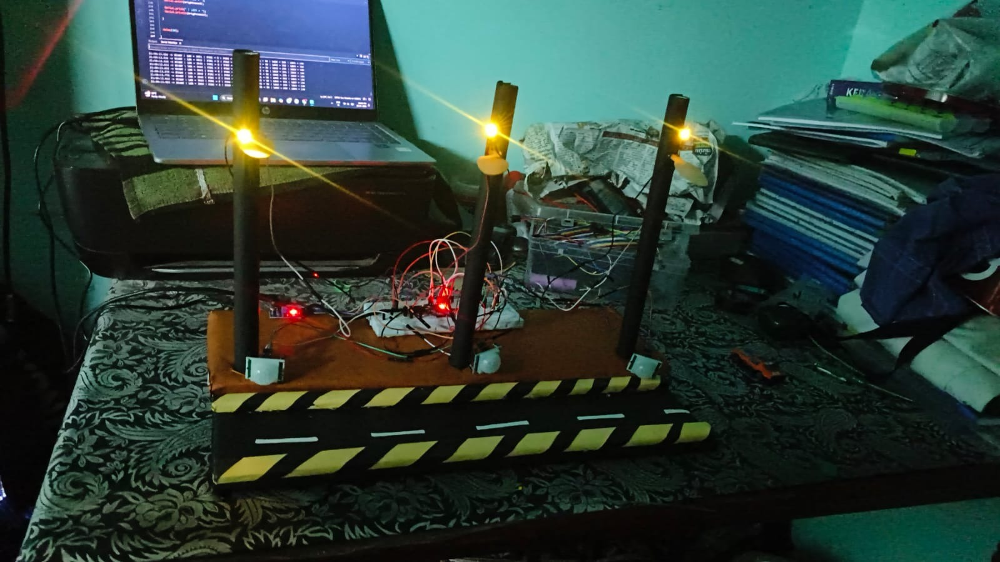
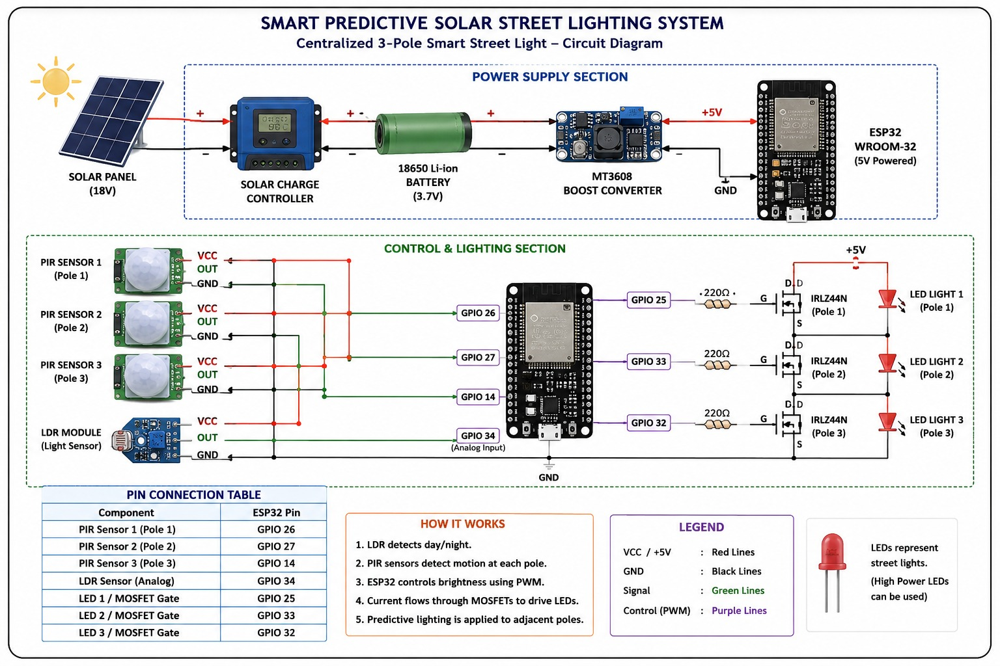

# 🌞 Smart Predictive Solar Street Lighting System

> An ESP32-based solar street lighting prototype with adaptive brightness and a predictive multi-pole lighting concept.

---

## 📌 About the Project

Traditional street lights often remain at high brightness even when there is little or no traffic. This can result in unnecessary energy consumption.

The **Smart Predictive Solar Street Lighting System** is designed to provide an energy-efficient and sustainable alternative using **solar power, motion detection, ambient-light sensing, and intelligent control**.



The system uses an **ESP32 microcontroller** to control street-light brightness according to the surrounding lighting conditions and detected movement.

The main concept is to create a **moving wave of illumination** along a road, where the upcoming lighting zone can be activated as movement progresses.

---

## 🎯 Problem Statement

Conventional street lights may consume energy continuously even when roads are empty.

This project aims to:

* 💡 Reduce unnecessary lighting power consumption
* 🚶 Provide brighter illumination when movement is detected
* ☀️ Utilize solar energy for sustainable operation
* 🔋 Store and efficiently utilize solar energy
* 🛣️ Develop a predictive lighting concept for multiple street-light poles
* ⚡ Improve overall energy efficiency

---

## 💡 How It Works

The prototype consists of the following major components:

| Component       | Function                              |
| --------------- | ------------------------------------- |
| **PIR Sensor**  | Detects human/vehicle movement        |
| **LDR Sensor**  | Detects ambient light intensity       |
| **ESP32**       | Main controller of the system         |
| **LED**         | Represents the street light           |
| **MOSFET**      | Controls LED switching and brightness |



### Basic Operation

```text
              🌙 Night / Low Ambient Light
                         ↓
                  💡 Low Brightness
                         ↓
                  🚶 Motion Detected
                         ↓
                  💡 High Brightness
                         ↓
                    Motion Ends
                         ↓
                      Timeout
                         ↓
                  💡 Low Brightness
